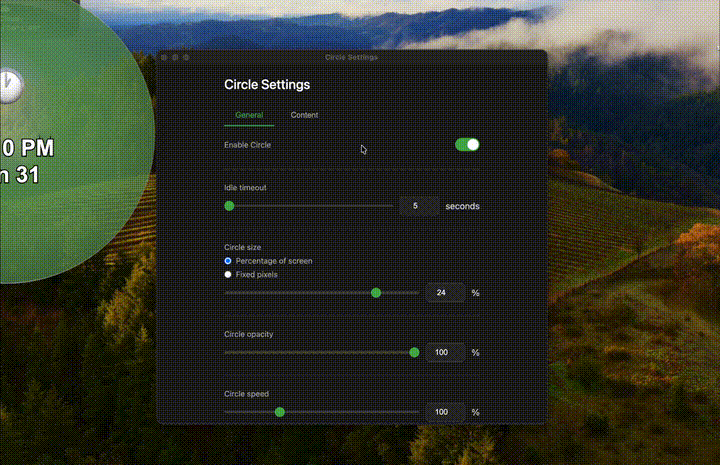

# Circle

A cross-platform OLED screensaver designed for both productivity users and general use. Displays a bouncing circle with rotating content to prevent burn-in whether you're idling, working, or away from your desk.


[](https://buymeacoffee.com/sihekuang)



## Features

- **Burn-in Prevention** - A bouncing circle continuously moves across your screen, preventing static elements from burning into OLED panels
- **Content Providers** - Display useful information inside the circle:
  - Clock (12/24 hour format)
  - Stock ticker (real-time prices from Yahoo Finance)
  - System info (CPU, memory, battery)
- **Multiple Themes** - Minimal, Soft, Glassy, and Abstract visual styles
- **Idle Detection** - Automatically activates after a configurable idle period
- **Always-On Mode** - Toggle with a global hotkey to keep the screensaver running
- **Multi-Monitor Support** - Works across all connected displays
- **System Tray App** - Runs quietly in your menu bar/system tray
- **Proximity Fade** - Circle becomes transparent when near your cursor or text caret, so it won't distract you while working

## Installation

### From Releases

Download the latest release for your platform from the [Releases](../../releases) page.

### From Source

```bash
# Clone the repository
git clone https://github.com/yourusername/circle.git
cd circle

# Install dependencies
npm install

# Run the app
npm start
```

## Building

```bash
# Build for current platform
npm run build

# Build for specific platforms
npm run build:mac
npm run build:win
npm run build:linux
```

## Usage

1. Launch Circle - it will appear in your system tray/menu bar
2. Right-click the tray icon to access settings or test the overlay
3. Configure idle timeout, content providers, and themes in Settings
4. Use the global hotkey (default: `Cmd/Ctrl+Shift+O`) to toggle Always-On mode

### Settings

- **Idle Timeout** - How long before the screensaver activates (default: 5 minutes)
- **Content Rotation** - Enable/disable providers and set rotation interval
- **Theme** - Choose your preferred visual style
- **Always-On Hotkey** - Customize the keyboard shortcut
- **Launch at Login** - Start Circle automatically when you log in

## Content Providers

| Provider | Description | Refresh Rate |
|----------|-------------|--------------|
| Clock | Current time and date | 1 second |
| Stocks | Stock prices with gain/loss colors | 2 minutes |
| System | CPU, memory, battery status | 2 seconds |

See [Content Providers Documentation](docs/content-providers.md) for details on adding custom providers.

## Proximity Fade

The circle automatically fades when it gets close to your cursor or text caret, preventing distraction while you work.

### Settings

- **Fade near cursor** - Toggle the feature on/off
- **Fade distance** - How far from the circle edge the fade begins (50-500px)

### Platform Support

| Platform | Cursor Tracking | Caret Tracking |
|----------|----------------|----------------|
| macOS | ✅ Full support | ✅ Native apps only |
| Windows | ✅ Full support | ❌ Not yet implemented |
| Linux | ✅ Full support | ❌ Not yet implemented |

### macOS Caret Tracking Limitations

Caret (text cursor) tracking uses macOS Accessibility APIs and requires permission:

1. On first launch, you'll be prompted to grant Accessibility permission
2. Go to **System Settings → Privacy & Security → Accessibility**
3. Enable the toggle for Circle

**Known limitations:**

| App Type | Status | Notes |
|----------|--------|-------|
| Native macOS apps | ✅ Works | TextEdit, Notes, Terminal, Xcode, etc. |
| Electron apps | ⚠️ Limited | VS Code, Slack - may report incorrect position |
| Web browsers | ❌ No support | Caret inside web content not accessible |
| Java/Qt apps | ⚠️ Varies | Depends on accessibility implementation |

When caret tracking isn't available, the feature falls back to cursor-only tracking, which works in all applications.

## Development

```bash
# Run in development mode
npm start

# Generate app icons from SVG
npm run generate-icons
```

### Project Structure

```
src/
├── main/           # Electron main process
│   ├── main.js     # App entry point
│   ├── config.js   # Settings management
│   ├── caretTracker.js  # Caret position tracking
│   ├── idleMonitor.js
│   ├── trayManager.js
│   └── windowManager.js
├── native/         # Native addons
│   └── caret_tracker.mm  # macOS caret tracking (Obj-C++)
├── overlay/        # Screensaver overlay
│   ├── providers/  # Content providers
│   ├── themes/     # Visual themes
│   └── background/ # Background animations
├── settings/       # Settings window
└── toast/          # Toast notifications
```

## Requirements

- macOS 10.13+, Windows 10+, or Linux with X11
- Node.js 18+ (for development)

## License

MIT
